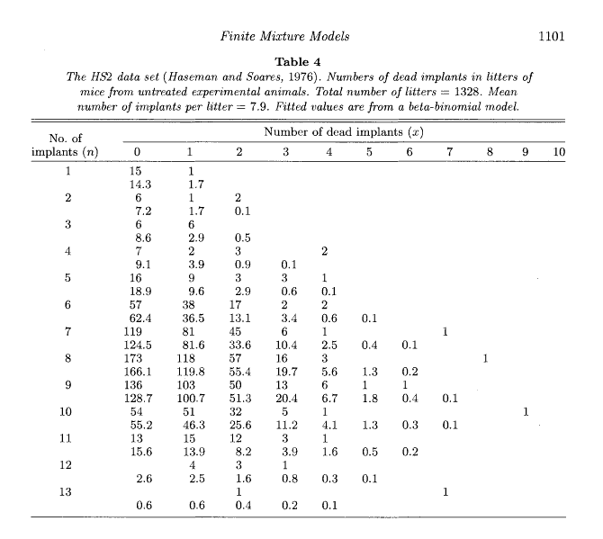

```{r setup, include=FALSE}
knitr::opts_chunk$set(echo = TRUE)
```


# MCEM

#### Goal
Find
$\text{argmax}_\theta f(y|\theta)$
where
$f(y| \theta) = \int f(y, \alpha| \theta) d\alpha$

Instead, find
$\text{argmax}_\theta E_{\alpha | y} [f(y, \alpha|\theta)]$

#### EM algorithm

- E-Step <br>
  Construct the function $Q(\theta|\theta^{(k)}) := \text{E}( \log f(y, \alpha| \theta) | y, \theta^{(k)}) \approx \frac{1}{L}\sum_l \log f(y, \alpha_\text{MC}^{(l)} | \theta)$ <br>
  where $\alpha_\text{MC}^{(l)}$'s are MCMC samples of $\alpha|y, \theta^{(k)}$

  Use MCMC algorithm such as Metropolis-Hastings. In general we can use NUTS https://mc-stan.org/users/interfaces/rstan.

- M-Step <br>
  $\theta^{(k+1)} = \text{argmax}_\theta Q(\theta|\theta^{(k)})$
  
  Use `optim` in R.

#### Metropolis-Hastings algorithm

Draw MCMC samples of $\alpha|y, \theta^{(k)}$.

https://en.wikipedia.org/wiki/Metropolis%E2%80%93Hastings_algorithm

Burin-in: Use the stationary sequence

Thining:  Independent samples

#### Standard error estimation

standard errors of the MLEs -- asymptotic covariance matrix -- Fisher information matrix

Compute the observed Fisher information matrix for MCEM.

> Gelman, Andrew, and Xiao-Li Meng, eds. Applied Bayesian modeling and causal inference from incomplete-data perspectives. John Wiley & Sons, 2004.
> Page 256 equation (23.6)

```{r message=F}
library(tidyverse)
library(lme4)
lamb <- read.csv(file = "lamb.csv") %>%
        mutate(Sire = factor(Sire),
               Line = factor(Line),
               Age  = factor(Age)
        )
lamb_reml <- lmer(Weight ~ 1 + (1|Sire), data = lamb)
y = getME(lamb_reml, "y")
X = getME(lamb_reml, "X")
Z = getME(lamb_reml, "Z")
r = 10

E_step <- function(theta, y, X, Z, r) {
  n = dim(Z)[1]
  k = dim(Z)[2]
  beta      <- theta$beta
  tau_sq    <- theta$tau_sq
  sigma_sq  <- theta$sigma_sq
  
  alpha_given_data = replicate(r, {
                          solve(t(Z)%*%Z/tau_sq + diag(k)/sigma_sq,
                                t(Z)%*%(y - X%*%beta + sqrt(tau_sq)*rnorm(n))/tau_sq
                          ) +sqrt(1/sigma_sq)*rnorm(k)
                     })
  fr = function(x) {
    mean(sapply(alpha_given_data, function(alpha) {
      sum((y - (X * x[1] * 2 + Z %*% alpha))^2) / x[2] + n*log(x[2]) + sum(alpha^2) / x[3] + k*log(x[3])
    }))
  }
  return(fr)
}

M_step <- function(fr, theta) {
  out = optim(c(theta$beta[1]/2, theta$tau_sq, theta$sigma_sq), fr,
              lower = 1e-10, upper = 20, method = "L-BFGS-B")
  return(list(beta=array(2*out$par[1], 1), tau_sq=out$par[2], sigma_sq=out$par[3], val = out$val))
}

# Initialization
theta = list(beta=array(mean(lamb$Weight), 1), tau_sq=sd(lamb$Weight)^2*0.5, sigma_sq=sd(lamb$Weight)^2*0.5)
for(i in 1:6){
  if(i==1) print(c("obj.", "beta", "tau_sq", "sigma_sq"))
  # E step
  qfun <- E_step(theta, y, X, Z, r+2*i)
  # M step
  theta <- M_step(qfun, theta)
  # Print result
  print(c(theta$val, theta$beta[1], theta$tau_sq, theta$sigma_sq))
}
```

```{r message=F}
summary(lamb_reml)
```


## GLMM

Finite Mixture Models for Proportions <br>
S. P. Brooks, B. J. T. Morgan, M. S. Ridout and S. E. Pack <br>
Biometrics Vol. 53, No. 3 (Sep., 1997), pp. 1097-1115 (19 pages) <br>
https://www.jstor.org/stable/2533567?seq=1#page_scan_tab_contents

Robust estimation in generalised linear mixed models <br>
Jiming Jiang  Weihong Zhang <br>
Biometrika, Volume 88, Issue 3, 1 October 2001, Pages 753–765 <br>
https://academic.oup.com/biomet/article/88/3/753/340112

The data set is fitted by generalized linear mixed model with Bernoulli response $y_{ij}$, $i = 1, \dots, 1328$, $j = 1, \dots, n_i$, where $n_i$ is the size of the $i$ th litter;

$y_{ij} = 1$ if the $j$ th implant in the $i$ th litter is dead, and $y_{ij} = 0$ otherwise. 

The total number of responses is $N = \sum_{i = 1}^{1328} n_i = 10533$. 


Ugly codes I had long time ago. It works but it is a bad example brute-force for-loop. Please use vectorized R codes.
```{r message=F}
library(tidyverse)
library(lme4)

nlist <- list()
nlist[[1]] <- c(15,1)
nlist[[2]] <- c(6,1,2)
nlist[[3]] <- c(6,6)
nlist[[4]] <- c(7,2,3,NA,2)
nlist[[5]] <- c(16,9,3,3,1)
nlist[[6]] <- c(57,38,17,2,2)
nlist[[7]] <- c(119,81,45,6,1,NA,NA,1)
nlist[[8]] <- c(173,118,57,16,3,NA,NA,NA,1)
nlist[[9]] <- c(136,103,50,13,6,1,1)
nlist[[10]] <- c(54,51,32,5,1,NA,NA,NA,NA,1)
nlist[[11]] <- c(13,15,12,3,1)
nlist[[12]] <- c(NA,4,3,1)
nlist[[13]] <- c(NA,NA,1,NA,NA,NA,NA,1)

mice <- vector()
count <- 0
for (k in 1:13) {
  for (l in 1:length(nlist[[k]])) {
    if(!is.na(nlist[[k]][l]))
    {
      for (m in 1:nlist[[k]][l]) {
        count <- count + 1
        mice <- rbind(mice, c(l-1, k))
      }
    }
  }
}
mice = as.data.frame(mice)
names(mice) = c( "Ndead", "Nimplants")
mice$litter = 1:dim(mice)[1]
mice$litter = factor(mice$litter)
```

```{r}
print(head(mice, 20))
```
The link function is logit. The linear predictor is $\eta_{ij} = \mu + \alpha_i$, where $\alpha_1 , \dots, \alpha_m$ are random effects independent and distributed as $N (0, \sigma^2)$, and $\sigma$ and $\mu$ are unknown parameters. 

The exponential family is Bernoulli distribution, with $P(y_{ij} = 1 | \alpha) = p_{ij}$. Therefore we have $y_{ij}$ conditionally independent such that 
$$
\text{logit} \{ P(y_{ij} = 1 | \alpha) \} = \mu + \alpha_i .
$$

Find $\sigma$ and $\mu$ such that $\log f(y, \alpha| \mu, \sigma)$ is maximized. 

```{r}
m1 <- glmer(cbind(Ndead, Nimplants-Ndead) ~ 1 + (1|litter), family = binomial, data = mice)
summary(m1)
```

#### Sampling random effect given data and variance-compoment using MH

```{r, eval=FALSE}
mh_algorithm <- function(mydata, mu_current, sigma_current, init_sample, n_sample, n_burnin, n_thin) {
  n_alpha = dim(mydata)[1]
  gamma_func <- function(alpha_new, alpha_old) {  
    pmin(1, 
         ### acceptance probability
         ### output: array of size n_alpha
    )
  }
  candidate_func <- function(alpha_old) {
    ### jumping distribution
    ### output: array of size n_alpha
  }
  
  n <- n_thin*n_sample + n_burnin
  alpha_sample <- matrix(0.0, ncol = n, nrow = n_alpha)
  alpha_sample[,1] <- init_sample
  for (step in 2:n) {
    alpha_sample_candidate <- candidate_func(alpha_sample[, step-1])
    u <- runif(n_alpha)
    flag <- u < gamma_func(alpha_sample_candidate, alpha_sample[, step-1])
    alpha_sample[, step] <- alpha_sample_candidate * flag + alpha_sample[, step-1] * (1 - flag)
  }
  return(alpha.sample[,seq(n_burnin+1, n, by=n_thin)]) ## n_alpha by n_sample matrix
}
```

#### Sampling random effect given data and variance-compoment using MCMC software Stan

```{r, message=F}
library(rstanarm)

mu_current = -2.0
sigma_current = 0.8
litter_index = 500:1000

mice_sample = mice[litter_index,]
mice_sample$mu = rep(mu_current, dim(mice_sample)[1])
m_post <- stan_glm(cbind(Ndead, Nimplants-Ndead) ~ 0 + litter,
                   offset = mu,
                   prior = normal(0.0, sigma_current),
                   family = binomial,
                   data = mice_sample,
                   seed = 1997,
                   chains = 1,
                   keep_every = 2,
                   iter = 400)
```

```{r}
ggplot(gather(as.data.frame(m_post)[,1:10]), aes(value))+ 
  geom_histogram(bins = 10) + 
  facet_wrap(~key, scales = 'free_x')
```
```{r, message=FALSE}
library(reshape2)
df <- as.data.frame(m_post)[,1:5]
df$time = 1:dim(df)[1]
df <- melt(df,  id.vars = 'time', variable.name = 'series')
ggplot(df, aes(time,value)) + geom_line() + facet_grid(series ~ .)
```

#### Approximate integration

https://github.com/lme4/lme4/blob/master/misc/logLikGLMM/logLikGLMM.R

